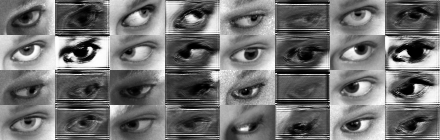
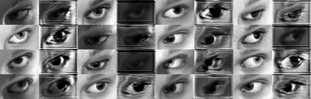

# SimGAN_pytorch
** Refer to [wayaai/SimGAN](https://github.com/wayaai/SimGAN)(Keras&amp;Tensorflow) **
Implementation of Apple's Learning from Simulated and Unsupervised Images through Adversarial Training
---

## Thank
I used Tensorflow and Keras before, and recently I'm learning pytorch. So I transfered the code of https://github.com/wayaai/SimGAN (Tensorflow+Keras) to pytorch.

The code of https://github.com/wayaai/SimGAN helps me a lot, thanks!
Some code in my repository still use his, It contains:
1. mpii_gaze_dataset_organize.py
2. image_history_buffer.py
---

## Statement
My experiment can not reach the result of the Paper [Learning from Simulated and Unsupervised Images through Adversarial Training](https://arxiv.org/abs/1612.07828)

I have tried lots of hyper parameter and network structure, but the result is still bad.
The network structure in my code is deferent from wayyai's code now.

The results of my exiperiments is bellow:
 
 
---

## Something about training GAN
Someone told me some tricks about [how to train GAN](https://github.com/soumith/ganhacks)
Thank him and the people who contribute to https://github.com/soumith/ganhacks.
It helps me a lot. And I learn a lot from it.
---

## Dataset
You can download the dataset refer to https://github.com/wayaai/SimGAN.

1. [MPIIGaze Dataset](http://datasets.d2.mpi-inf.mpg.de/MPIIGaze/MPIIGaze.tar.gz) (2.8G) 
You can see more details about this dataset in [here](https://www.mpi-inf.mpg.de/departments/computer-vision-and-multimodal-computing/research/gaze-based-human-computer-interaction/appearance-based-gaze-estimation-in-the-wild-mpiigaze/).
You should use the code[mpii_gaze_dataset_organize.py]  of  [wayaai](https://github.com/wayaai/SimGAN) to process the dataset.
2. UnityEyes Dataset
You can use a [software](http://www.cl.cam.ac.uk/research/rainbow/projects/unityeyes/) to generate image.
The company [wayaai](https://github.com/wayaai/SimGAN) provide a 50000 images dataset, you can download it in [here](http://www.cl.cam.ac.uk/~eww23/data/syntheseyes_data.zip)
You can see more details about this dataset in [here](http://www.cl.cam.ac.uk/research/rainbow/projects/unityeyes/)

I only use 1.2M UnityEyes images(52 pics), and 214k MPIIGaze images(144 pics) like where the [paper](https://arxiv.org/abs/1612.07828) said.

---

## Environment
1.  python3.5
2. pytorch 0.2
---

## Now
I still tuning the parameters and checking if something wrong in my code...
